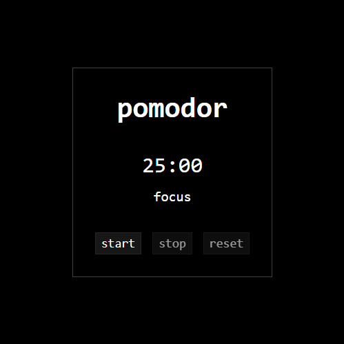

# Pomodor 🍅

A minimalistic Pomodoro timer built with **HTML, CSS and JavaScript**.

Simple, distraction-free and focused on productivity.

---

## ✨ Features

- 25 min focus / 5 min break cycle
- Start, stop and reset controls
- Dynamic tab title with time and status
- Minimal black & white UI
- No frameworks, no dependencies

---

## 🛠️ Built with

- HTML
- CSS
- Vanilla JavaScript

---

## 🚀 Usage

Just open `index.html` in your browser or visit the deployed version.

---

## 📦 Project structure

